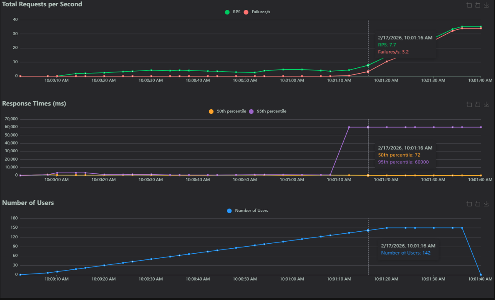
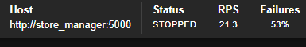
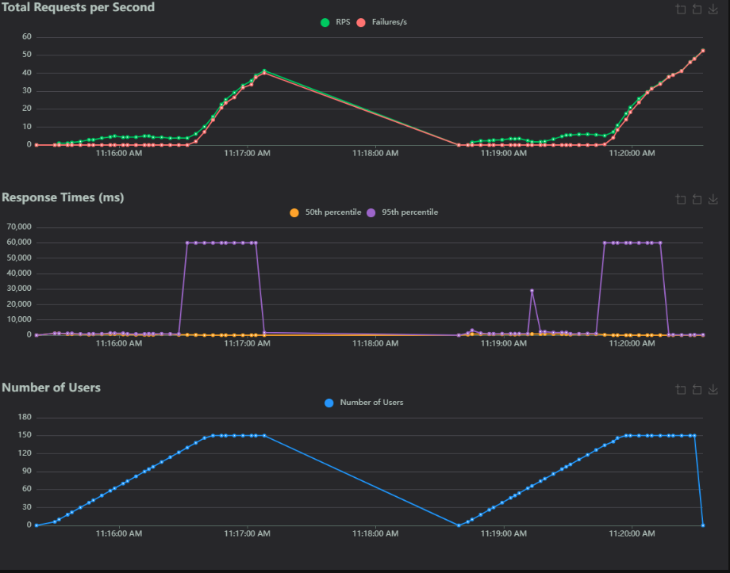

# Laboratoire 4 - Optimisation, Caching, Load Balancing, Test de charge, Observabilité  
**Table des matières**
1. Introduction, description des fichiers et définition.
2. Réponse aux question.

## 1. Introduction, description des fichiers et définitions.

### Context et introduction ###
**Veuillez noter que que mon compte GitHub scolaire, celui avec inscrit à l'adresse benjamin.tardif.1@ens.etsmtl.ca n'est pas disponible pour l'instant. Mon compter a été hacké cet été et GitHub m'a bloqué l'accès. Les démarches ont été entreprises pour retrouver les droits d'accès. Conséquemment, le repertoire de GitHUb Classroom a été recopié de manière locale afin de pouvoir produire les demandes de laboratoire.**

Ce laboratoire est le cinquième d'une suite de laboratoires donnés dans le cadre du cour LOG430 - architecture logiciel. Il a pour objectif d'apprendre à l'étudiant les méthodes standards concernant l'observabilité d'un logiciel dans le but de le rendre adaptatif afin de l'optimiser. Cette optimistion se fait par le test de charge, le caching et le load balancing.

### Objectifs du laboratoire ###
Tel que décrit dans l'énoncé du laboratoire. 
* Apprendre à configurer Prometheus
* Apprendre à effectuer des tests de charge avec Locust
* Comprendre les types d'optimisation possibles dans le contexte du Store Manager ainsi que les avantages et inconvénients de chacun
* Apprendre à implémenter le cache en mémoire avec Redis et l'équilibrage de charge (load balancing) avec Nginx

### Definitions et principes ### 
* Cache en memoire: Sert à entreposer temporairement les données utilisées fréquemment par un logiciel afin de réduire la latence d'un logiciel.
* load balancing: le processus par lequel un application distribue la charge de travail sur plusieurs serveurs/machines de manière à ce qu'aucun d'eux ne sature. Cette pratique améliore l'échellonage d'un logiciel et sa disponibilité.
* Locust: Outil open source qui test la charge d'un site avec le protocole HTTP.
* Nginx: Outil de load balancing
* Observabilité: Principe par lequel l'état interne d'un système est découvert à l'externe de celui-ci. Permet la compréhension sur ce qu'un système logiciel fait et pourquoi il le fait.
* Prometheus: Engin de monitoring permetant d'envoyer des alertes

## 2. Réponses aux questions.
**Question 1 : Combien d'utilisateurs faut-il pour que le Store Manager commence à échouer dans votre environnement de test ? Pour répondre à cette question, comparez la ligne Failures et la ligne Users dans les graphiques.** 

  

À 134 utilisateurs la première apparait. 

  

À 142 utilisateurs les échecs commencent à être remarquable sur le graphique

**Question 2 : Sur l'onglet Statistics, comparez la différence entre les requêtes et les échecs pour tous les endpoints. Combien d'entre eux échouent plus de 50 % du temps ?**  


  

La question formulée bizarrement. Le taux d'échec varie dans le temps. La capture d'écran présentée démontre l'état du système lorsque 150 utilisateurs font des requêtes. Comme on peut le voir, en amont le système échoue 53% du temps(289/546). Le end point qui échoue le plus est '*/orders*' suivi de '*/orders/reports/highest-spenders*' avec 36% (72/198) avec '*/orders/reports/best-sellers*' avec 34% (84/212). Il est important de noter que '*/orders*' est une méthode post alors que les deux autres sont des méthodes GET.

**Question 3 : Affichez quelques exemples des messages d'erreur affichés dans l'onglet Failures. Ces messages indiquent une défaillance dans quelle(s) partie(s) du Store Manager ? Par exemple, est-ce que le problème vient du service Python / MySQL / Redis / autre ?**


Les méthodes POST indiquent une erreur concernant l'accessibilité du serveur qui est saturé. "Too many connections" indique qu'il est impossible pour le serveur de traiter toutes les demandes en même temps. Les erreurs des GET découle du crash "Internal Server Error".

**Question 4 : Sur l'onglet Statistics, comparez les résultats actuels avec les résultats du test de charge précédent. Est-ce que vous voyez quelques différences dans les métriques pour l'endpoint POST /orders ?**

Code a priori a priori à l'intervention.:
```
    try:
        start_time = time.time()
        # TODO: optimiser
        product_prices = {}
        for product_id in product_ids:
            products = session.query(Product).filter(Product.id == product_id).all()
            if not len(products):
                raise ValueError(f"Product ID {product_id} not found in database.")
            product_prices[product_id] = products[0].price
        total_amount = 0
        order_items = []
```

Code suite à l'intervention: 
```
    try:
        start_time = time.time()
        # Obtenir tous les produits de la base de donnees
        products = session.query(Product).filter(Product.id.in_(product_ids)).all()
        # Initier la liste des prix
        product_prices = {}
        
        # Iterer dans les produits et non dans les ids
        for product in products:
            product_prices[product.id] = product.price
            
        total_amount = 0
        order_items = []
```
Comme vous pouvez le constater l'appel à la base de données est sortie de la boucle. Les prix sont appellés à partir de la liste créée tel que demandé dans l'énoncé de laboratoire. Le code suite à l'intervention à même été validé par le chargé de laboratoire (Achref Samoud). Toutefois les courbes ne changent pas:   



Une erreur à l'extérieur de ce qui est demandé pour cette étape empêche la démonstration de la compréhension par les chiffres attendus. Toutefois, les chiffres n'y sont pas, mais la compréhension l'est. 

**Question 5 : Si nous avions plus d'articles dans notre base de données (par exemple, 1 million), ou simplement plus d'articles par commande en moyenne, le temps de réponse de l'endpoint POST /orders augmenterait-il, diminuerait-il ou resterait-il identique ?**

# ANNEXE
