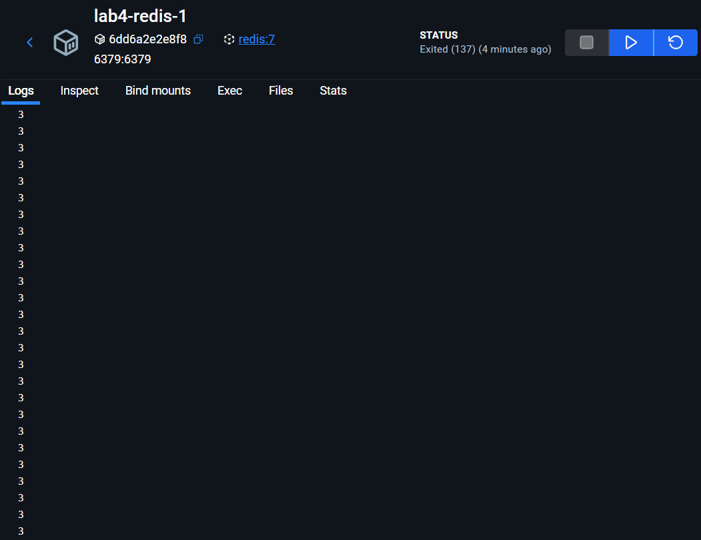
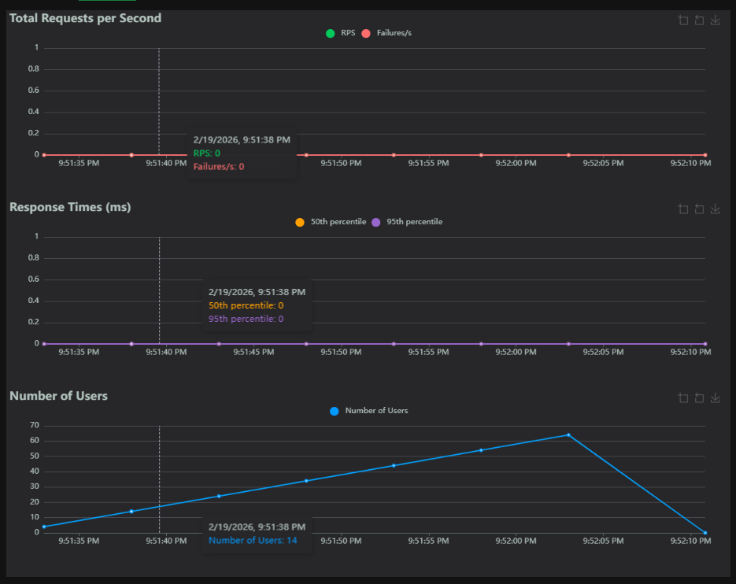
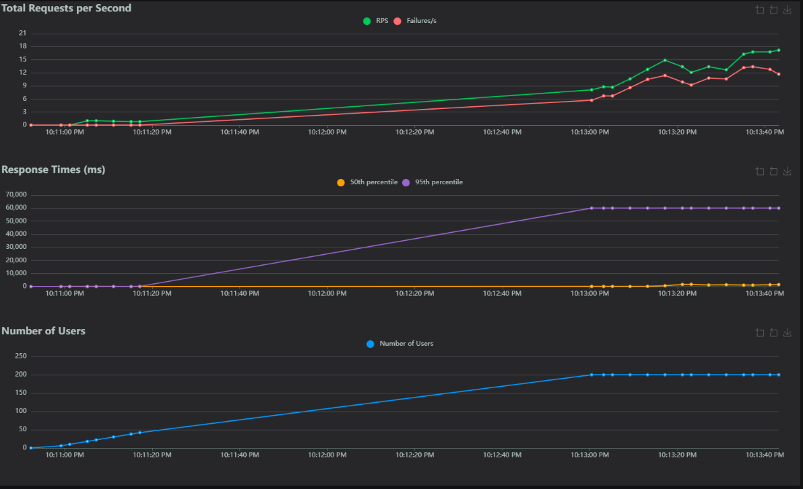
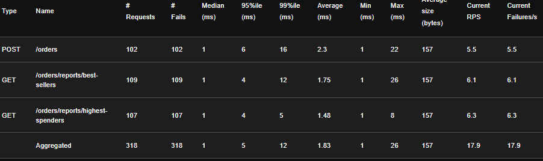
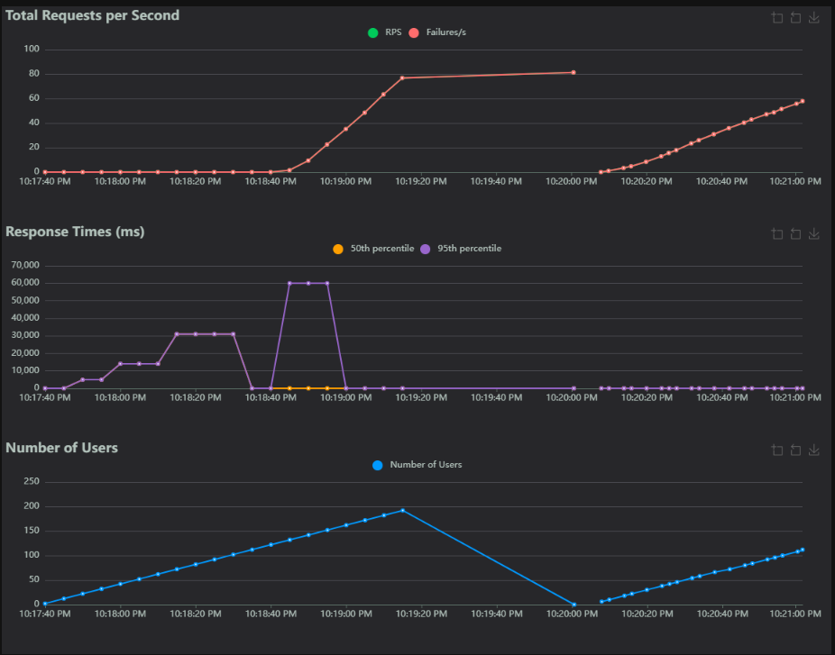

# Laboratoire 4 - Optimisation, Caching, Load Balancing, Test de charge, Observabilité  
**Table des matières**
1. Introduction, description des fichiers et définition.
2. Réponse aux question.

## 1. Introduction, description des fichiers et définitions.

### Context et introduction ###
**Veuillez noter que que mon compte GitHub scolaire, celui avec inscrit à l'adresse benjamin.tardif.1@ens.etsmtl.ca n'est pas disponible pour l'instant. Mon compter a été hacké cet été et GitHub m'a bloqué l'accès. Les démarches ont été entreprises pour retrouver les droits d'accès. Conséquemment, le repertoire de GitHUb Classroom a été recopié de manière locale afin de pouvoir produire les demandes de laboratoire.**

Ce laboratoire est le cinquième d'une suite de laboratoires donnés dans le cadre du cour LOG430 - architecture logiciel. Il a pour objectif d'apprendre à l'étudiant les méthodes standards concernant l'observabilité d'un logiciel dans le but de le rendre adaptatif afin de l'optimiser. Cette optimistion se fait par le test de charge, le caching et le load balancing.

### Objectifs du laboratoire ###
Tel que décrit dans l'énoncé du laboratoire. 
* Apprendre à configurer Prometheus
* Apprendre à effectuer des tests de charge avec Locust
* Comprendre les types d'optimisation possibles dans le contexte du Store Manager ainsi que les avantages et inconvénients de chacun
* Apprendre à implémenter le cache en mémoire avec Redis et l'équilibrage de charge (load balancing) avec Nginx

### Definitions et principes ### 
* Cache en memoire: Sert à entreposer temporairement les données utilisées fréquemment par un logiciel afin de réduire la latence d'un logiciel.
* load balancing: le processus par lequel un application distribue la charge de travail sur plusieurs serveurs/machines de manière à ce qu'aucun d'eux ne sature. Cette pratique améliore l'échellonage d'un logiciel et sa disponibilité.
* Locust: Outil open source qui test la charge d'un site avec le protocole HTTP.
* Nginx: Outil de load balancing
* Observabilité: Principe par lequel l'état interne d'un système est découvert à l'externe de celui-ci. Permet la compréhension sur ce qu'un système logiciel fait et pourquoi il le fait.
* Prometheus: Engin de monitoring permetant d'envoyer des alertes

## NOTE SUR LE RAPPORT
Les configurations obtenues à partir du repertoire de base ne fonctionnait pas la moitié du laboratoire n'a pu être émis. J'ai remis ce que j'ai pu faire. Je comprends les principes intentionnés. Je ne sais pas quoi faire dans cette situation. Le chargé est au courant de ma situation et même lui n'a pu m'aider. Vous avez mon repertoire git par discord, je vous l'ai envoyé en privé. Et je vous le transmets dans la remise.  


## 2. Réponses aux questions.
**Question 1 : Combien d'utilisateurs faut-il pour que le Store Manager commence à échouer dans votre environnement de test ? Pour répondre à cette question, comparez la ligne Failures et la ligne Users dans les graphiques.** 

  

À 134 utilisateurs la première apparait. 

  

À 142 utilisateurs les échecs commencent à être remarquable sur le graphique

**Question 2 : Sur l'onglet Statistics, comparez la différence entre les requêtes et les échecs pour tous les endpoints. Combien d'entre eux échouent plus de 50 % du temps ?**  


  

La question formulée bizarrement. Le taux d'échec varie dans le temps. La capture d'écran présentée démontre l'état du système lorsque 150 utilisateurs font des requêtes. Comme on peut le voir, en amont le système échoue 53% du temps(289/546). Le end point qui échoue le plus est '*/orders*' suivi de '*/orders/reports/highest-spenders*' avec 36% (72/198) avec '*/orders/reports/best-sellers*' avec 34% (84/212). Il est important de noter que '*/orders*' est une méthode post alors que les deux autres sont des méthodes GET.

**Question 3 : Affichez quelques exemples des messages d'erreur affichés dans l'onglet Failures. Ces messages indiquent une défaillance dans quelle(s) partie(s) du Store Manager ? Par exemple, est-ce que le problème vient du service Python / MySQL / Redis / autre ?**


Les méthodes POST indiquent une erreur concernant l'accessibilité du serveur qui est saturé. "Too many connections" indique qu'il est impossible pour le serveur de traiter toutes les demandes en même temps. Les erreurs des GET découle du crash "Internal Server Error".

**Question 4 : Sur l'onglet Statistics, comparez les résultats actuels avec les résultats du test de charge précédent. Est-ce que vous voyez quelques différences dans les métriques pour l'endpoint POST /orders ?**

Code a priori a priori à l'intervention.:
```
    try:
        start_time = time.time()
        # TODO: optimiser
        product_prices = {}
        for product_id in product_ids:
            products = session.query(Product).filter(Product.id == product_id).all()
            if not len(products):
                raise ValueError(f"Product ID {product_id} not found in database.")
            product_prices[product_id] = products[0].price
        total_amount = 0
        order_items = []
```

Code suite à l'intervention: 
```
    try:
        start_time = time.time()
        # Obtenir tous les produits de la base de donnees
        products = session.query(Product).filter(Product.id.in_(product_ids)).all()
        # Initier la liste des prix
        product_prices = {}
        
        # Iterer dans les produits et non dans les ids
        for product in products:
            product_prices[product.id] = product.price
            
        total_amount = 0
        order_items = []
```
Comme vous pouvez le constater l'appel à la base de données est sortie de la boucle. Les prix sont appellés à partir de la liste créée tel que demandé dans l'énoncé de laboratoire. Le code suite à l'intervention à même été validé par le chargé de laboratoire (Achref Samoud). Toutefois les courbes ne changent pas:   


Une erreur à l'extérieur de ce qui est demandé pour cette étape empêche la démonstration de la compréhension par les chiffres attendus. Toutefois, les chiffres n'y sont pas, mais la compréhension l'est. 

**Question 5 : Si nous avions plus d'articles dans notre base de données (par exemple, 1 million), ou simplement plus d'articles par commande en moyenne, le temps de réponse de l'endpoint POST /orders augmenterait-il, diminuerait-il ou resterait-il identique ?**

Il y a plusieurs scénarios décrits dans la question. Premièrement, s'il y avait 1 million de ligne l'appel à la BDD serait similaire. Toutefois, le temps de transfert des données serait plus long considérant le volume de la demande. Une fois les données transférées le temps est similaire aussi pour le scénarios 2 décrivant plusieurs articles dans une commande. 

**Question 6 : Sur l'onglet Statistics, comparez les résultats actuels avec les résultats du test de charge précédent. Est-ce que vous voyez quelques différences significatives dans les métriques pour les endpoints POST /orders, GET /orders/reports/highest-spenders et GET /orders/reports/best-sellers ? Dans quelle mesure la performance s'est-elle améliorée ou détériorée (par exemple, en pourcentage) ?**

Les mots manquent, les images aussi. Les environnements de ce laboratoire sont défaillants et les informations sont manquantes. Les modifications ont été apportées. Voici mes deux méthodes en Redis: 

Le code a été modifié car le code initiale ne fonctionnait pas. 

```
def get_highest_spending_users_redis():
    """Get report of highest spending users from Redis"""
    result = []
    try:
        start_time = time.time()
        r = get_redis_conn()

        # Check cache first
        report_in_cache = r.get("reports:highest_spending_users")
        if report_in_cache:
            try:
                return json.loads(report_in_cache)
            except Exception:
                # Fall through to regenerate if cache is corrupted
                pass

        limit = 10
        order_keys = r.keys("order:*")
        spending = defaultdict(float)

        for key in order_keys:
            order_data = r.hgetall(key)
            if b"user_id" in order_data and b"total_amount" in order_data:
                # redis returns bytes for hgetall when using redis-py
                user_id = int(order_data[b"user_id"]) if isinstance(order_data[b"user_id"], (bytes, bytearray)) else int(order_data["user_id"])
                total = float(order_data[b"total_amount"]) if isinstance(order_data[b"total_amount"], (bytes, bytearray)) else float(order_data["total_amount"])
                spending[user_id] += total

        # Trier par total dépensé (décroissant), limite X
        highest_spending_users = sorted(spending.items(), key=lambda x: x[1], reverse=True)[:limit]
        for user in highest_spending_users:
            result.append({
                "user_id": user[0],
                "total_expense": round(user[1], 2)
            })

        # Store report in cache for 60 seconds
        try:
            r.set("reports:highest_spending_users", json.dumps(result))
            r.expire("reports:highest_spending_users", 60)
        except Exception:
            # ignore cache write errors
            pass

    except Exception as e:
        return {'error': str(e)}

    end_time = time.time()
    logger.debug(f"Executed in {end_time - start_time} seconds")
    return result

def get_best_selling_products_redis():
    """Get report of best selling products by quantity sold from Redis"""
    result = []
    try:
        start_time = time.time()
        r = get_redis_conn()

        # Check cache first
        report_in_cache = r.get("reports:best_selling_products")
        if report_in_cache:
            try:
                return json.loads(report_in_cache)
            except Exception:
                pass

        limit = 10
        order_keys = r.keys("order:*")
        product_sales = defaultdict(int)

        for order_key in order_keys:
            order_data = r.hgetall(order_key)
            # items may be stored as bytes
            items_field = order_data.get(b"items") if isinstance(list(order_data.keys())[0], bytes) else order_data.get("items")
            if items_field:
                try:
                    products = json.loads(items_field if isinstance(items_field, str) else items_field.decode('utf-8'))
                except Exception:
                    continue

                for item in products:
                    product_id = int(item.get("product_id", 0))
                    quantity = int(item.get("quantity", 0))
                    product_sales[product_id] += quantity

        # Trier par total vendu (décroissant), limite X
        best_selling = sorted(product_sales.items(), key=lambda x: x[1], reverse=True)[:limit]
        for product in best_selling:
            result.append({
                "product_id": product[0],
                "quantity_sold": product[1]
            })

        # Store report in cache for 60 seconds
        try:
            r.set("reports:best_selling_products", json.dumps(result))
            r.expire("reports:best_selling_products", 60)
        except Exception:
            pass

    except Exception as e:
        return {'error': str(e)}
    
    end_time = time.time()
    logger.debug(f"Executed in {end_time - start_time} seconds")
    return result
```


Lorque cest end call sont fait dans Postman, la réponse est une attente car il y a une boucle inifinie qui me retourne ceci dans les logs de Redis : 



Conséquemment, aucun appel dans Locust n'est émis.



Il est donc impossible d'évaluer ce qui est demandé actuellement.

Il est toutefois possible de comparer le premier état (Requête SQL dans la boucle) et le dernier état (Redis à partir du ./optimization/read_order.py)



Comme on peut le constate le taux d'erreur est différent dû à la méthode par laquelle on obtient les données. Dans le deuxième cas, Redis prend l'information enregistré dans le cache de sorte que l'appel SQL n'aie pas à être fait.

**Question 7 : La génération de rapports repose désormais entièrement sur des requêtes adressées à Redis, ce qui réduit la charge pesant sur MySQL. Cependant, le point de terminaison POST /orders reste à la traîne par rapport aux autres en termes de performances dans notre scénario de test. Alors, qu'est-ce qui limite les performances de l'endpoint POST /orders ?**

L'écriture doit se faire dans la base de données. Il est facile d'obtenir des données en cache toutefois. Les données insérées dans la base de données demande plus d'effort logiciel.

**Question 8 : Sur l'onglet Statistics, comparez les résultats actuels avec les résultats du test de charge précédent. Est-ce que vous voyez quelques différences significatives dans les métriques pour les endpoints POST /orders, GET /orders/reports/highest-spenders et GET /orders/reports/best-sellers ? Dans quelle mesure la performance s'est-elle améliorée ou détériorée (par exemple, en pourcentage) ? La réponse dépendra de votre environnement d'exécution (par exemple, vous obtiendrez de meilleures performances en exécutant 2 instances de Store Manager sur 2 machines virtuelles plutôt que sur une seule).**






**nginx.conf dans la racine du projet**

```
events {
    worker_connections 1024;
}

http {
  upstream store_manager_nginx {
    least_conn;  
    server store_manager:5000;
  }

  server {
    listen 80;
    
    location / {
      proxy_pass http://store_manager_nginx;
    }
  }
}
```

**Nouveau docker compose**
```
services:
  store_manager:
    build: .
    volumes:
      - .:/app
    environment:
      - PYTHONUNBUFFERED=1
    networks:
      - labo04-network
    depends_on:
      mysql:
        condition: service_healthy
      redis:
        condition: service_healthy
    deploy:
      replicas: 2

  locust:
     image: locustio/locust
     ports:
       - "8089:8089"
     volumes:
       - ./locustfiles:/mnt/locust
     command: -f /mnt/locust/locustfile.py --host=http://nginx:80
     depends_on:
      - store_manager
     networks:
       - labo04-network

  prometheus:
    image: prom/prometheus:latest
    container_name: prometheus
    ports:
      - "9090:9090"
    volumes:
      - ./prometheus.yml:/etc/prometheus/prometheus.yml
      - prometheus_data:/prometheus
    command:
      - '--config.file=/etc/prometheus/prometheus.yml'
      - '--storage.tsdb.path=/prometheus'
      - '--web.console.libraries=/etc/prometheus/console_libraries'
      - '--web.console.templates=/etc/prometheus/consoles'
      - '--web.enable-lifecycle'
    networks:
      - labo04-network
    depends_on:
      - store_manager

  mysql:
    image: mysql:8.4.7
    restart: unless-stopped
    environment:
      MYSQL_ROOT_PASSWORD: root
      MYSQL_DATABASE: ${DB_NAME}
      MYSQL_USER: ${DB_USER}
      MYSQL_PASSWORD: ${DB_PASSWORD}
    networks:
      - labo04-network
    ports:
      - "3306:3306"
    volumes:
      - mysql_data:/var/lib/mysql
      - ./db-init:/docker-entrypoint-initdb.d
    healthcheck:
      test: ["CMD-SHELL", "mysqladmin ping -h localhost -u root -proot"]
      interval: 1m
      timeout: 10s
      retries: 5
      start_period: 10s

  redis:
    image: redis:7
    restart: unless-stopped
    networks:
      - labo04-network
    ports:
      - "6379:6379"
    volumes:
      - ./generators/redis_mock_data:/commands
      - ./redis_entrypoint.sh:/redis_entrypoint.sh
    entrypoint: /bin/bash /redis_entrypoint.sh
    healthcheck:
      test: ["CMD", "redis-cli", "ping"]
      interval: 1m
      timeout: 10s
      retries: 5
      start_period: 10s

  nginx:
    image: nginx:latest
    ports:
      - "8080:80"
    volumes:
      - ./nginx.conf:/etc/nginx/nginx.conf:ro
    depends_on:
      - store_manager
    networks:
      - labo04-network

networks:
  labo04-network:
    driver: bridge
    external: true

volumes:
  mysql_data:
  prometheus_data:

```

Tout échoue. Je ne peux pas apprendre ce que vous voulez m'apprendre. Je vais me reprendre au projet. Je sais plus quoi faire. J'ai vraiment tout essayé de debugger. J'ai même parlé au charger de laboratoire. On nous dit souvent que l'on doit se préparer au marché du travail et que c'est important de devoir s'adapter. Refaire ce laboratoire pour le rendre fonctionel dans les délais serait un death march project. Le cour commence en nous disant de pas les prendre.

Peut être que je suis un cas isolé. Je viendrai vous voir suite à la correction. Je veux apprendre, je suis déçu de pas pouvoir produire le laboratoire.


**Question 9 : Dans le fichier nginx.conf, il existe un attribut qui configure l'équilibrage de charge. Quelle politique d'équilibrage de charge utilisons-nous actuellement ? Consultez la documentation officielle de Nginx si vous avez des questions.**

Tout d'abord le nginx.conf configure un systeme nginx qui est instantié dans le docker-compose tel que décrit plustôt. Ensuite dans le déploiement de store_manager on indique qu'il faut faire deux replicas. De cette manière, NGinx peut regarder laquelle des deux instances est la moins chargée pour ensuite déployer les demandes de manières hétérogènes. C'est ce qui est décrit pas l'attribut least-conn insérer dans le fichier de configuration. 

# ANNEXE
